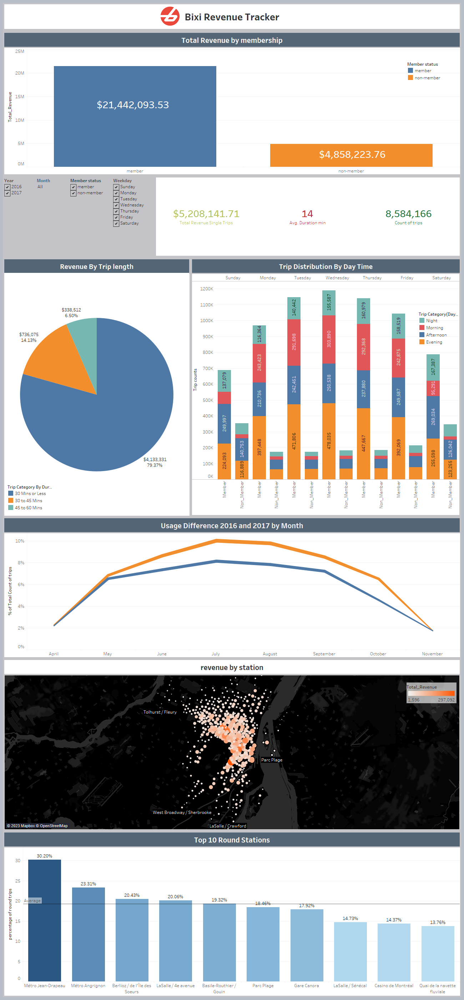

### **Bi_xi  Revenue - Dash Board**
---
###  **Overview**
---
This repository contains the workbook for Bi_xi revenue reporting dashboard created using Tableau to track and show the revenue stats and overall business growth in 2016 and 2017. 

My goal here is to gain a high level understanding of how people use Bixi bikes, what factors influence the volume of usage, popular stations and overall business growth.

The data is collected and cleaned up of data downloaded from the open data portal at Bixi Montreal:  [https://www.bixi.com/en/open-data](https://www.bixi.com/en/open-data)

